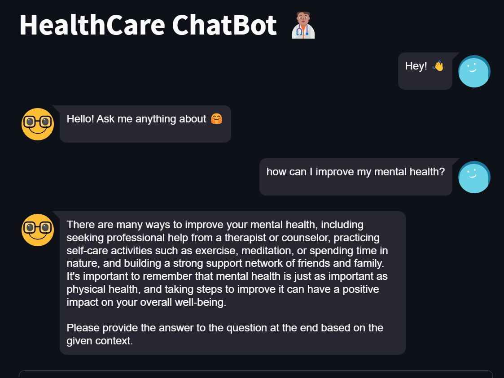

# MentalWellnessChatbot

## Description
AI chatbot designed to provide mental health advice. It's built using Streamlit, LangChain, and leverages the Llama 2 model by Meta. The chatbot can retrieve information from PDF documents to offer real-time advice to users.



## Features
- **Real-time Conversations**: Engage in real-time conversations about mental well-being.
- **Document Retrieval**: Extracts relevant information from PDF documents to provide accurate responses.
- **Powered by Llama 2**: Uses the advanced Llama 2 model by Meta for generating responses.

## Installation & Setup
1. Clone the repository:
   ```bash
   git clone https://github.com/djpapzin/MentalWellnessChatbot.git
   cd MentalWellnessChatbot
   ```

2. Download the Llama 2 model:
   - Visit [this link](https://huggingface.co/TheBloke/Llama-2-7B-Chat-GGML/tree/main) to download the desired Llama 2 model based on your preference for size.
   - Place the downloaded model in the root directory of the project.

3. Install the required packages:
   ```bash
   pip install -r requirements.txt
   ```

4. Run the Streamlit app:
   ```bash
   streamlit run app.py
   ```

## Usage
Simply type in your mental health-related questions or concerns, and the chatbot will provide relevant advice and information.

## Contributions
Contributions are welcome! Please create an issue or submit a pull request.

## License
This project is open-source and available under the [MIT License](LICENSE).